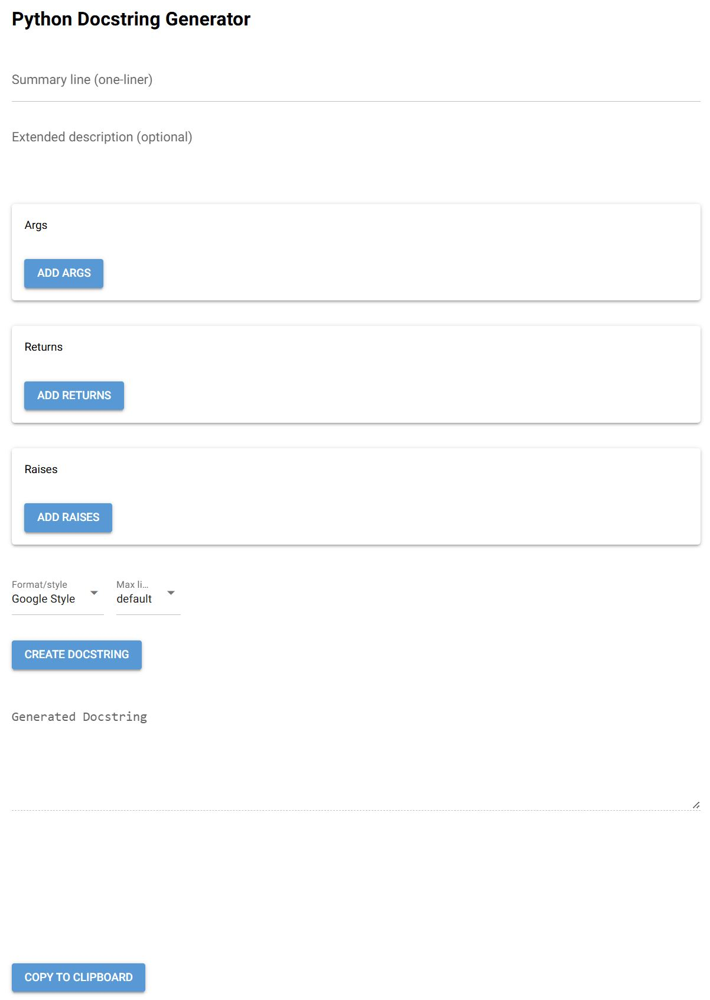

# Python docstring generator

This repository contains a NiceGUI-based web application that supports generating Python docstrings in three popular formats:

Google, reStructuredText (reST) and NumPy

## Features

- Dynamic web form for entering:
  - One-line summary.
  - Extended description.
  - Arguments.
  - Return values.
  - Raised exceptions.
- Style selection: Google, reST, NumPy.
- Default line wrapping override, through selectable max length (e.g. 79, 100, 120 chars).
- One-click clipboard copy.
- All user input preserved as written (line breaks, indentation).

## Screenshot



## Installation

```bash
pip install nicegui
git clone https://github.com/MichaelHallik/python-docstring-generator.git
cd python-docstring-generator
python main.py
```

Then visit [http://localhost:8080](http://localhost:8080) in your browser.

## Requirements

- Python 3.8 or higher
- [NiceGUI](https://github.com/zauberzeug/nicegui)

## Why use this?

Writing structured and standards-compliant docstrings by hand can be tedious.

This tool simplifies that by guiding you through each section and taking care of the formatting.

## Project structure

```text
main.py          # Entry point for the app with UI, formatting, and logic.
README.md        # Project documentation and usage.
TECHNICAL.md     # Technical implementation details.
```

## Future improvements

- Beautify the Web UI.
- Support docstring parsing and conversion.
- Add export/import templates.
- Add unit tests.

## 🪪 License

MIT License