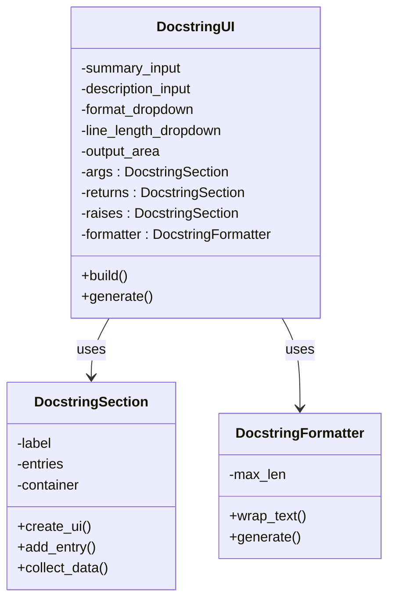

# Technical Overview

This document covers design decisions and technology stack behind the Python Docstring Generator.

## Key components

### `DocstringUI`

- Coordinates UI layout, controls, and user interactions
- Holds references to user inputs and format dropdowns

### `DocstringSection`

- Encapsulates UI logic for reusable blocks (Args, Returns, Raises)
- Provides a list of name/description fields

### `DocstringFormatter`

- Handles string formatting based on selected style
- Applies wrapping logic while preserving line breaks and indentation

## Design patterns

- Separation of Concerns:
  - Logic split into formatting, UI, and input handling
- Encapsulation:
  - Each responsibility is isolated in a dedicated class
- Factory Method (UI context)
  - Uses UI builders to dynamically append inputs

## Python libraries used

### [NiceGUI](https://github.com/zauberzeug/nicegui)
- Modern web UI framework for Python
- Renders Tailwind-styled widgets via FastAPI + Vue.js backend

### `textwrap` (standard library)
- Used to apply line wrapping to descriptions

## Class diagram

## Entry point

`main.py` constructs and launches the UI when executed as a script.

## Future improvements

- Beautify the Web UI.
- Support docstring parsing and conversion.
- Add export/import templates.
- Add unit tests.